## Build

```
docker build -t muratkirazkaya/perf-runner:latest -f perf-runner/Dockerfile perf-runner
```

## Publish

```
docker push muratkirazkaya/perf-runner:latest
```

Hub Repo: https://hub.docker.com/r/muratkirazkaya/perf-runner

## Pray

```
sudo rm -fr ./*
```

## Diagram

<details>
<summary>Vertical Diagram</summary>


</details>

<details>
<summary>Sequence Diagram</summary>

[![](https://mermaid.ink/img/pako:eNrtVl1PGzkU_StXfiihmslnE5J5qJYNNFRdSkSRKlVIlZm5E7zM2F7bU2AR_73-mHwHGlX7uA8gX8-5x9fHJ75-IqnIkCRE4z8V8hRPGJ0pWl5zAFoZwavyBpWLJFWGpUxSbmByBlTDhJmz6gaOU8ME15uYE5HeoXK4ejQW3FDGt9lUxa9QG-2wdhwbFzTLv7coU8FzNnOwMNqFqQwrPJMf7EI4-suK81Cci2Llw11ghboqzFSJ1Ffno1jaELUWOzNmzNxWN8fTjy4hBDGVLEAdeHIWv38fNEngSrHZzFYiUeV1GW5zQSho3Nt8QP4DflClD112SLQMc9USKC24cRjI57MWEDRKbGrBMmpw7OOGZwnf4jWaWl0P3yLzaiYwQ-NmPogiQ6Ub-CDzcFwtT-tR66wF0wZE7nWGPOQF9kIICR-EAqTp7ep393Ft8eWJJfPpxkFB3fRBBFyWwLg2tChgejz-dDw5_SN8jGrCw8AY_i_JVo4BHzD98shTUCXEKoeWKWXLn4n3R6CLAxu8eQPlXcYUxBKazeY-tKm0tNCiUrZWNAt8rbfQbO1Dsly0ZbCUvqg9F99c-a2z4yrPXgV4pfcG7jySvbLtjbS4CHyhL-SuG81jLv0vNBjs1x5KKc_8b2PDRk6u_8w8i0X-98_v-Mct_XuuWQj_unEWsBe9s2wC7pYs7W1fY3UjHEG05r5ok7K20JJm8-J1lEwLflEZWe2sYAVcFJiaHUlgG8X2xb3MdGL604NMcAxAWhhgOUwvv388AVs0jC_Oz08_X11dfDr9DNJWjNxsVbNoca4hWD3tRqeXY1GWFtyoBfrL3vv1vhfwrW27hD9F9vjaClJos8I9T9mLe2pzMfPSFBpfUVUqZlv3OVV3mbjn9UnZx4FwXVGLAnfLu-LD0wdmlp17pVNbzOQsga9C3eWFuAdbkfSnV6BzJolIicq28Mw-wp5c3jUxt1jiNUnsMMOcOlOSa_5soe5J5txOEqMqjIgS1eyWJDm124tIJZ3n6hfcYta-Sr4JUc5TbEiSJ_JAkm5v1Oy3--1hb9R51-10R0cReSTJsNcc9jvDUafdGfS6w87Rc0T-9QTt5tFgMLR__eFRdzDodSKCGTNCnYc3pH9KRmSm3GbqAq1oqMai4oYknfao__wTbvmjGA?type=png)](https://mermaid.live/edit#pako:eNrtVl1PGzkU_StXfiihmslnE5J5qJYNNFRdSkSRKlVIlZm5E7zM2F7bU2AR_73-mHwHGlX7uA8gX8-5x9fHJ75-IqnIkCRE4z8V8hRPGJ0pWl5zAFoZwavyBpWLJFWGpUxSbmByBlTDhJmz6gaOU8ME15uYE5HeoXK4ejQW3FDGt9lUxa9QG-2wdhwbFzTLv7coU8FzNnOwMNqFqQwrPJMf7EI4-suK81Cci2Llw11ghboqzFSJ1Ffno1jaELUWOzNmzNxWN8fTjy4hBDGVLEAdeHIWv38fNEngSrHZzFYiUeV1GW5zQSho3Nt8QP4DflClD112SLQMc9USKC24cRjI57MWEDRKbGrBMmpw7OOGZwnf4jWaWl0P3yLzaiYwQ-NmPogiQ6Ub-CDzcFwtT-tR66wF0wZE7nWGPOQF9kIICR-EAqTp7ep393Ft8eWJJfPpxkFB3fRBBFyWwLg2tChgejz-dDw5_SN8jGrCw8AY_i_JVo4BHzD98shTUCXEKoeWKWXLn4n3R6CLAxu8eQPlXcYUxBKazeY-tKm0tNCiUrZWNAt8rbfQbO1Dsly0ZbCUvqg9F99c-a2z4yrPXgV4pfcG7jySvbLtjbS4CHyhL-SuG81jLv0vNBjs1x5KKc_8b2PDRk6u_8w8i0X-98_v-Mct_XuuWQj_unEWsBe9s2wC7pYs7W1fY3UjHEG05r5ok7K20JJm8-J1lEwLflEZWe2sYAVcFJiaHUlgG8X2xb3MdGL604NMcAxAWhhgOUwvv388AVs0jC_Oz08_X11dfDr9DNJWjNxsVbNoca4hWD3tRqeXY1GWFtyoBfrL3vv1vhfwrW27hD9F9vjaClJos8I9T9mLe2pzMfPSFBpfUVUqZlv3OVV3mbjn9UnZx4FwXVGLAnfLu-LD0wdmlp17pVNbzOQsga9C3eWFuAdbkfSnV6BzJolIicq28Mw-wp5c3jUxt1jiNUnsMMOcOlOSa_5soe5J5txOEqMqjIgS1eyWJDm124tIJZ3n6hfcYta-Sr4JUc5TbEiSJ_JAkm5v1Oy3--1hb9R51-10R0cReSTJsNcc9jvDUafdGfS6w87Rc0T-9QTt5tFgMLR__eFRdzDodSKCGTNCnYc3pH9KRmSm3GbqAq1oqMai4oYknfao__wTbvmjGA)
</details>

### TODO

- [x] Run perf-test-lib tests inside Docker for multiple Node.js versions
- [x] Execute tests for each subfolder in expf-tests
- [x] Compare latest vs candidate results per test
- [x] Print comparison (e.g., execution time differences)
- [x] Extract req/sec, latency, throughput from autocannon output
- [x] Create Markdown or CSV table for all test comparisons
- [x] Optionally send results to PR comment
- [x] split run-tests.mjs into multiple files for more readable code
- [ ] Optionally send results to external dashboard
- [x] Optimize Dockerfile, it's big as hell (149.9 MB) (decreased to 55.9 MB)
- [ ] Add act (Run your GitHub Actions locally) support
- [x] Fix repeating logics in client repositories, extract reuseable logic into npm package (used template mechanism)
- [x] Make each test folder has static package.json, not dynamic (so we don't need to have dependency of testing libraries in our library)
- [x] Decrease file count 2 to 1 with like as 
```js
// /expf-tests/simple/main.mjs
class PerfTest {
  constructor(label, options) {
    this.label = label;
    this.options = options;
  }

  async start() { /* start server */ }
  async run() { /* run autocannon */ }
  async report() { /* format + send */ }
  async stop() { /* close server */ }
}

const test = new PerfTest(label, config);
await test.start();
await test.run();
await test.report();
await test.stop();
```

